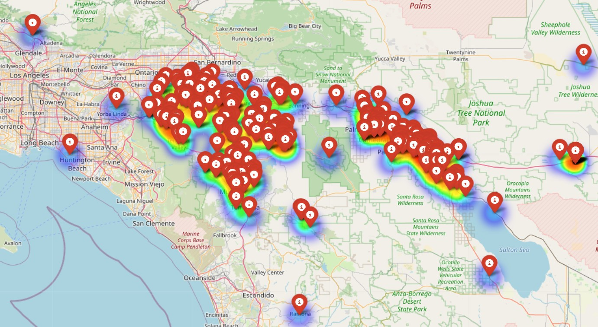

# Riverside Accidents Scraper and Mapping



This project scrapes local accident reports from a news website, extracts relevant information, and visualizes accident locations on an interactive map. The locations are geocoded using the Google Maps API, and a heatmap is generated to show accident density in Riverside County, California.

### Requirements

- Python 3.x
- Libraries: `requests`, `beautifulsoup4`, `spacy`, `geopy`, `folium`, `googlemaps`, `pandas`
- Google Maps API Key

### Installation

1. Clone the repository to your local machine:

   ```bash
   git clone https://github.com/ParkerWilliams1/riverside-accidents.git
   cd riverside-accidents
    ```
<<<<<<< HEAD

2. Run scraper.py to scrape the accidents website

   ```bash
   python3 scraper.py
   ```

3. Run clean_corpus.py to clean the corpus
   ```bash
   python3 cleaning_file/clean_corpus.py
   ```

4. Run extract_streets.py to geolocate each accident, create a DataFrame, and generate a map of the accidents.
   ```bash
   python3 extract_streets.py
   ```

5. Open the map by running start accident_map.html to view the geolocated accidents.
   ```bash
   start accident_map.html
   ```
=======
>>>>>>> 2e182009221aed261241b735b2b22ced52f707f1
